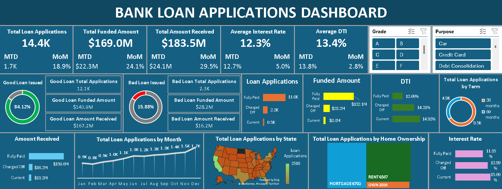

# 🏦 Bank Loan Applications Tracking Dashboard

## 📌 Project Overview
An interactive Excel dashboard built to monitor and analyze bank loan applications, tracking approval rates, funded amounts, repayment performance, and risk distribution across 14,000+ loan records. The dashboard enables grade-wise and purpose-wise filtering to support data-driven lending decisions.

---

## 🛠️ Tools Used
- **Microsoft Excel** — Dashboard design and data visualization
- **Pivot Tables** — Data aggregation and summarization
- **Excel Charts** — Visual representation of loan trends and distributions
- **Dataset:** Bank Loan Applications Data (BankLoanApplicationsData.csv)

---

## 📊 Dashboard Features

### KPI Cards
- Total Loan Applications: **14.4K** | MTD: 1.7K | MoM: 18.9%
- Total Funded Amount: **$169.0M** | MTD: $22.3M | MoM: 24.1%
- Total Amount Received: **$183.5M** | MTD: $24.1M | MoM: 29.5%
- Average Interest Rate: **12.3%** | MTD: 12.7% | MoM: 5.0%
- Average DTI (Debt-to-Income): **13.4%** | MTD: 13.8% | MoM: 2.8%

### Good Loan vs Bad Loan Analysis
| Metric | Good Loan | Bad Loan |
|--------|-----------|----------|
| % Issued | 84.12% | 15.88% |
| Total Applications | 12.1K | 2.3K |
| Funded Amount | $140.9M | $28.2M |
| Amount Received | $167.2M | $16.2M |

### Loan Status Breakdown
| Status | Applications | Funded Amount | Amount Received | Avg DTI | Avg Interest Rate |
|--------|-------------|---------------|-----------------|---------|-------------------|
| Fully Paid | 11.6K | $132.1M | $156.0M | 13.09% | 11.85% |
| Charged Off | 2.3K | $28.2M | $16.2M | 14.31% | 13.99% |
| Current | 0.5K | $8.8M | $11.3M | 14.93% | 15.09% |

### Visualizations
- **Donut Charts** — Good Loan vs Bad Loan issued percentage
- **Clustered Bar Charts** — Loan Applications, Funded Amount, DTI, Amount Received, and Interest Rate by loan status
- **Line Chart** — Total Loan Applications by Month (Jan–Dec trend)
- **Filled Map** — Total Loan Applications by U.S. State
- **Treemap** — Total Loan Applications by Home Ownership (Mortgage, Rent, Own)
- **Donut Chart** — Total Loan Applications by Term (36 months vs 60 months)
- **Grade Slicer** — Filter by loan grades A, B, C, D, E, F
- **Purpose Slicer** — Filter by loan purpose (Car, Credit Card, Debt Consolidation, etc.)

---

## 🔍 Key Insights
- **84.12%** of all loans were classified as Good Loans (Fully Paid), while **15.88%** were Bad Loans (Charged Off)
- Loan applications showed a **consistent upward trend** from 0.9K in January to 1.7K in December
- **60-month term loans (9.5K)** were nearly double the 36-month term loans (4.9K), indicating borrower preference for longer repayment periods
- **Mortgage holders (6,703)** were the largest borrower group, followed by Rent (6,587) and Own (1,058)
- Charged Off loans carried a higher average interest rate (**13.99%**) and DTI (**14.31%**) compared to Fully Paid loans, indicating higher-risk borrower profiles

---

## 🧹 Data Preparation
- Cleaned and structured raw loan data with 14,400+ records and 24 variables
- Built Pivot Tables to aggregate data by loan status, grade, state, purpose, and home ownership
- Created MTD (Month-to-Date) and MoM (Month-over-Month) metrics for performance tracking
- Designed dynamic slicers for interactive filtering by Grade and Purpose

---

## 📁 Files in This Repository
| File | Description |
|------|-------------|
| `Bank Loan Applications Data.xlsx` | Excel dashboard file |
| `BankLoanApplicationsData.csv` | Raw dataset used for analysis |
| `Bank_Loan_Dashboard_Preview.png` | Dashboard screenshot |
| `README.md` | Project documentation |

---

## 📬 Contact
**Pushkar Sharma**
- 📧 sharmapushkarmail@gmail.com
- 💼 [LinkedIn](https://linkedin.com/in/sharma-pushkar)
- 🐙 [GitHub](https://github.com/PushkarSharmaGit)
